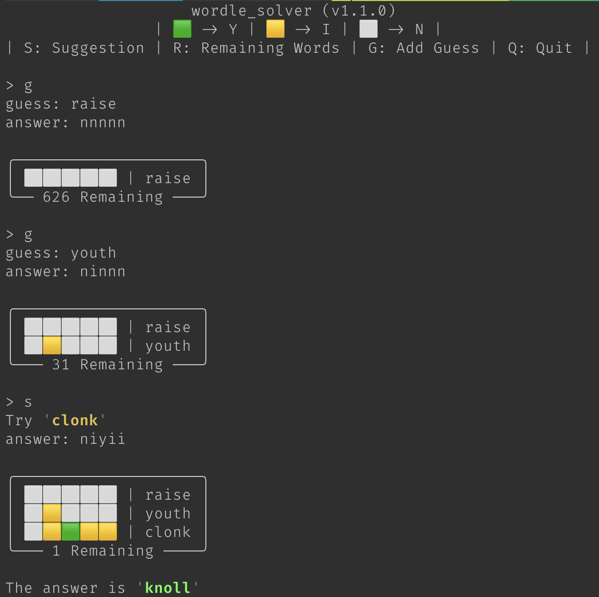

# Wordle Solver

<!-- HTML here because we want centre alignment -->
<p align="center"><i>An interactive solver tool for <a href="https://www.powerlanguage.co.uk/wordle/">Wordle</a>.</i></p>
<p align="center">
    <a href="https://github.com/Nadock/wordle_solver/actions/workflows/code_checks.yml">
        
    </a>
    <a href="https://www.python.org">
        
    </a>
    <a href="https://github.com/psf/black">
        
    </a>
    <a href="https://github.com/Textualize/rich">
        
    </a>
</p>

## Install

Currently `wordle_solver` is not published to PyPi or similar so you will need to clone
the repo and install the required dependencies with `pipenv`.

```bash
git clone git@github.com:Nadock/wordle_solver.git
cd wordle_solver
pipenv install
```

## Usage

The default interactive mode can be run via:

```bash
pipenv run python -m wordle_solver
```

### In-Progress Games

`wordle_solver` can assist with an in-progress Wordle game with the `--guess/-g` and
`--answer/-a` flags. There must be a `--answer` option for each `--guess` option. Each
guess and answer will be paired up in the order they are supplied on the command line.

### Non-Interactive Options

`wordle_solver` can generate a suggestion without interaction with the `--suggest/-s`
flag. Alternatively, `wordle_solver` can output all the possible words remaining for
the current game with the `--remain/-r` flag.

## Input Mapping

The valid inputs and mapping from Wordle outputs to `wordle_solver` inputs is displayed
on startup in interactive mode.

| Wordle | `wordle_solver` | Description                   |
| ------ | --------------- | ----------------------------- |
| 🟩      | `Y`             | Green letter in Wordle        |
| 🟨      | `M`             | Yellow letter in Wordle       |
| ⬜ or ⬛ | `N`             | Grey letter in Wordle         |
|        | `S`             | Generate a suggested guess    |
|        | `R`             | List remaining possible words |
|        | `G`             | Add a guess of your own       |
|        | `Q`             | Quit `wordle_solver`          |


## Example Game

This example is based on Wordle 219 (2022-01-24):


